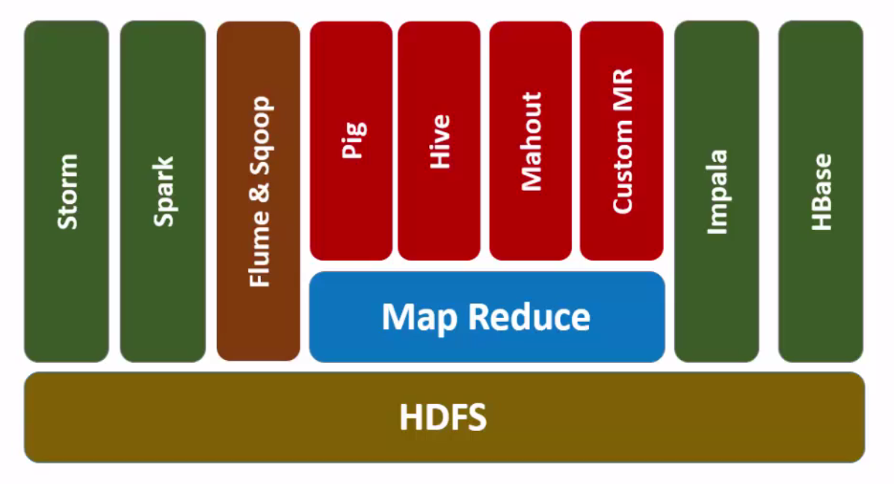
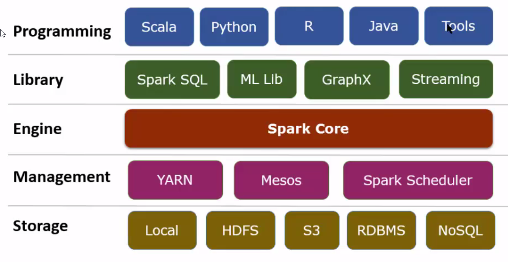

# The Big Data Menagerie
The goal here is to break away from the fancy terminology and provide a simple way of thinking about the big data technology set as a whole. Many of the terms or statements will sound 'wrong' but that is by design, we really need to focus on gaining intuition about the field and not get bogged down by getting things done 'correctly'. The correctness can be cultivated when we go deeper into the subject and actually implement things.

## Mental Model
It helps to think of the the ecosystem as a distributed computing environment where:
* Lightweight, disposable containers
* work on top of 'ephemeral' virtual machines
* that live on physical infrastructure

## Things that a Big Data ecosystem would need 
A basic setup would need one or more:
* *Workers* - nodes that actually execute the processing task
* *Managers* - nodes that track the jobs
* *Schedulers* - nodes that provide coordination services and may additionally manage how the resources are shared among the jobs
* *Name Nodes* - nodes that maintain *where* a node exists and how to address it

### *additionally*
* *Storage* - to persist the data (S3, local, HDFS, RDBMS, NoSQL etc.)
	* *Data Store* - this is a special case where we care about the structure of the data - so we ask questions like is it columnar or key value or just a stream or documents etc.
	* Storage and data store components come in two flavors *regular* and *in memory*
* *Data Import* - to acquire data into the ecosystem (from other RDBMS, data streams, etc.)
* *Data Query* - ability to run SQL like analysis on the data once it's in the Big Data ecosystem
* *Algorithms* - a library that gives a default implementation of common Statistical and Machine Learning algorithms - understand that these are implemented in a way that best exploits the distributed nature of the entire setup
* *Extensions* - You have a distributed system that can do many many things and not just map-reduce processing on large volumes of data, so you'd need extensions that provide additional functionality 
* *Libraries* - These provide API access to various components in the ecosystem - APIs may be specific to a particular language or may provide support for multiple languages
* *Messaging* - Parts of the distributed system would pass messages and enable data flow - from one process to another, from one node to another, from one cluster to another. A message queue or a message broker would take care of this task. Popular implementations are ZeroMQ (or 0mq) and RabbitMQ. 

## Stacks

